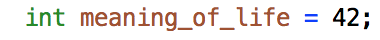
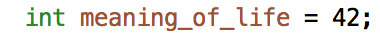

[![License GPL 3][badge-license]](http://www.gnu.org/licenses/gpl-3.0.txt)

# Modern C++ font-lock for Emacs #

Syntax coloring support for "Modern C++" - until C++17 and TS (Technical Specification). It is recommended to use it in addition with the `c++-mode` major-mode.

## Preview ##

Soon.

## Installation ##

### Manual ###

#### Global setup ####

Download `modern-cpp-font-lock.el` into a directory of your [load-path][load-path]. Place the following lines in a suitable init file:

    (require 'modern-cpp-font-lock)
    (modern-c++-font-lock-global-mode t)

`modern-c++-font-lock-mode` will be activated for buffers using the `c++-mode` major-mode.

#### Local ####

For the current buffer, the minor-mode can be turned on/off via the command:

<kbd>M-x modern-c++-font-lock-mode [RET]</kbd>

### Melpa ###

Soon.

## Configuration ##

You can modify the following lists to recognize more words or set it to `nil` to partially disable font locking:

 * `modern-c++-types` - list of C++ types
 * `modern-c++-hash-preprocessors` - list of C++ preprocessor words starting with `#`
 * `modern-c++-_preprocessors` - list of C++ preprocessor words starting with `_`
 * `modern-c++-__preprocessors__` - list of C++ preprocessor words surounded with `__`
 * `modern-c++-__preprocessors` - list of C++ preprocessor words starting with `__`
 * `modern-c++-keywords` - list of C++ keywords
 * `modern-c++-attributes` - list of C++ attributes
 * `modern-c++-attribute-reasons` - list of C++ attributes containing a reason
 * `modern-c++-operators-assignment` - list of C++ assignment operators
 * `modern-c++-operators-increment-decrement` - list of C++ increment/decrement operators
 * `modern-c++-operators-arithmetic` - list of C++ arithmetic operators
 * `modern-c++-operators-logical` - list of C++ logical operators
 * `modern-c++-operators-comparison` - list of C++ comparison operators
 * `modern-c++-operators-member-access` - list of C++ member access operators
 * `modern-c++-operators-other` - list of C++ other operators
 * `modern-c++-operators-all` - list of C++ operators

### Example: Disable font-lock for all operators ###

With `c++-mode` and `modern-c++-font-lock-mode` enabled, you will see by default:

Add `(setq modern-c++-operators-all nil)` in the init file to disable font locking for all C++ operators. Now, `=` is no more highlighted:

## Mode line ##

When `modern-c++-font-lock-mode` is activated, `mc++fl` is displayed.

Happy coding! :skull:

[Lud][lud]

[lud]: http://lud.cc
[load-path]: https://www.gnu.org/software/emacs/manual/html_node/emacs/Lisp-Libraries.html
[badge-license]: https://img.shields.io/badge/license-GPL_3-green.svg
